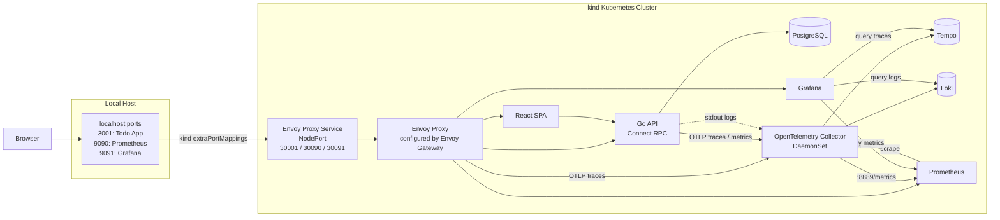

# k8s-playground

## Overview

This repository provides an easy-to-spin-up local Kubernetes cluster for experimenting with a Todo application.
It is designed for trying out web application development with Go, React, and Protocol Buffers, as well as
Kubernetes and observability tools.

## Architecture



## Tech Stack

### Backend

- Go
- Connect RPC
- Protocol Buffers
- PostgreSQL
- sqlc
- golang-migrate

### Frontend

- React
- TypeScript
- Vite
- React Router
- TanStack Query
- shadcn/ui
- Tailwind CSS

### Platform

- Docker
- Kubernetes
- kind
- Helmfile
- Envoy Gateway
- Kubernetes Gateway API

### Observability

- Prometheus
- Grafana
- OpenTelemetry Collector
- Tempo
- Loki

### Development Tools

- mise
- buf
- Air
- pnpm

## Setup

### Requirements

- Docker Desktop
- [mise](https://mise.jdx.dev/)

### Initialize

Trust the local mise configuration and install the required tools and dependencies.

```sh
mise trust
make setup
```

## Local Development

Start PostgreSQL and apply the database migrations.

```sh
make db-dev
make db-migrate
```

Start the backend and frontend development servers in separate terminals.

```sh
make backend-dev
```

```sh
make frontend-dev
```

Open the Todo application:

- Frontend: http://localhost:5173
- Backend: http://localhost:8080

## Kubernetes

Create a local kind cluster and deploy the application, Envoy Gateway, Prometheus, Grafana, Tempo, Loki, and the OpenTelemetry Collector.

```sh
make k8s-init
```

Open the deployed services:

| Service          | URL                   |
| ---------------- | --------------------- |
| Todo application | http://localhost:3001 |
| Prometheus       | http://localhost:9090 |
| Grafana          | http://localhost:9091 |

Grafana uses the following local development credentials:

```text
username: admin
password: admin
```

These credentials are intended only for the local playground environment.

To recreate the kind cluster from scratch, delete the existing cluster before running the initialization command again.
This removes the existing cluster and its local data.

```sh
make k8s-delete-cluster
make k8s-init
```

## Observability

Prometheus scrapes application metrics exposed by the Go API at `/metrics`.
Grafana is provisioned with Prometheus as its default data source through Helm values.
Use Grafana Explore or the Prometheus UI to query the metrics.
